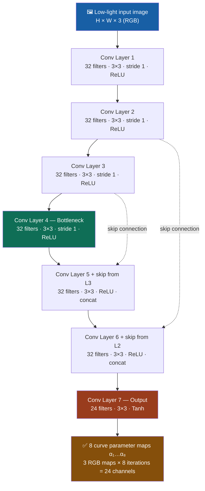

# Zero-DCE: DCE-Net Architecture Diagram

This document provides a visual diagram of how the 7-layer CNN (DCE-Net)
produces the 8 curve parameter maps used in the Zero-DCE low-light
image enhancement process.

## Architecture Overview

## Key Design Decisions

| Property | Value | Reason |
|---|---|---|
| Layers | 7 conv layers | Lightweight (~79K params) |
| Filters (L1–L6) | 32, kernel 3×3 | Capture local features |
| Activation (L1–L6) | ReLU | Non-linearity without vanishing gradients |
| Activation (L7) | Tanh | Constrains output to [-1, 1] |
| Skip connections | L2→L6, L3→L5 | Symmetrical, preserves spatial detail |
| Output channels | 24 (3 × 8) | One α map per RGB channel per iteration |
| No pooling / BN | Intentional | Preserves neighboring pixel relationships |

## How the Curve Parameters Work

Each of the **8 iterations** applies a Light-Enhancement (LE) curve:
LE(I; α) = I + α · I · (1 - I)
Where `α` is the pixel-wise curve parameter map predicted by DCE-Net.
The curve is applied **iteratively** to progressively brighten the image
without clipping highlights.

## References

- Paper: [Zero-Reference Deep Curve Estimation (CVPR 2020)](https://arxiv.org/abs/2001.06826)
- Authors: Chunle Guo et al.